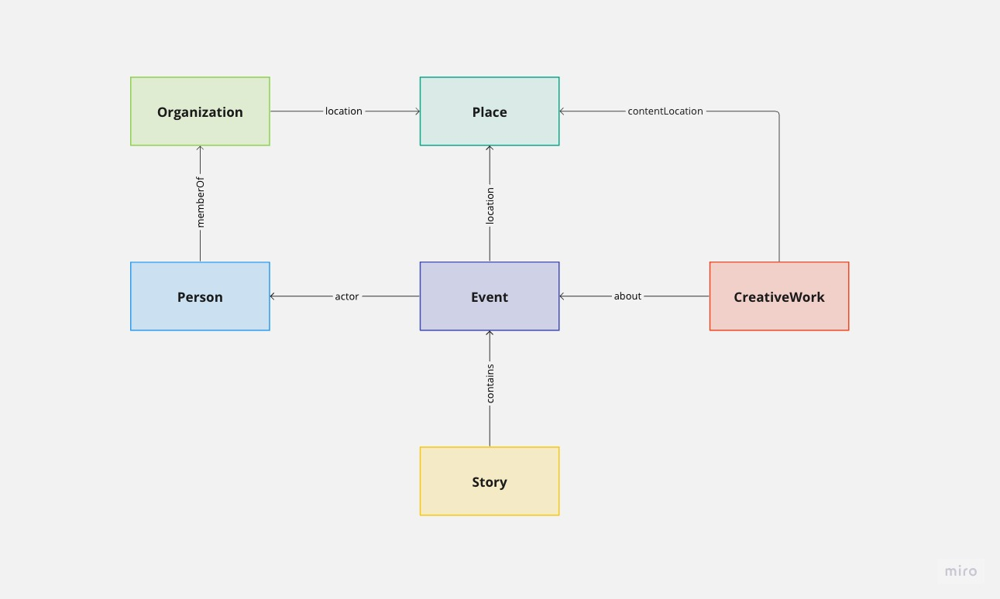
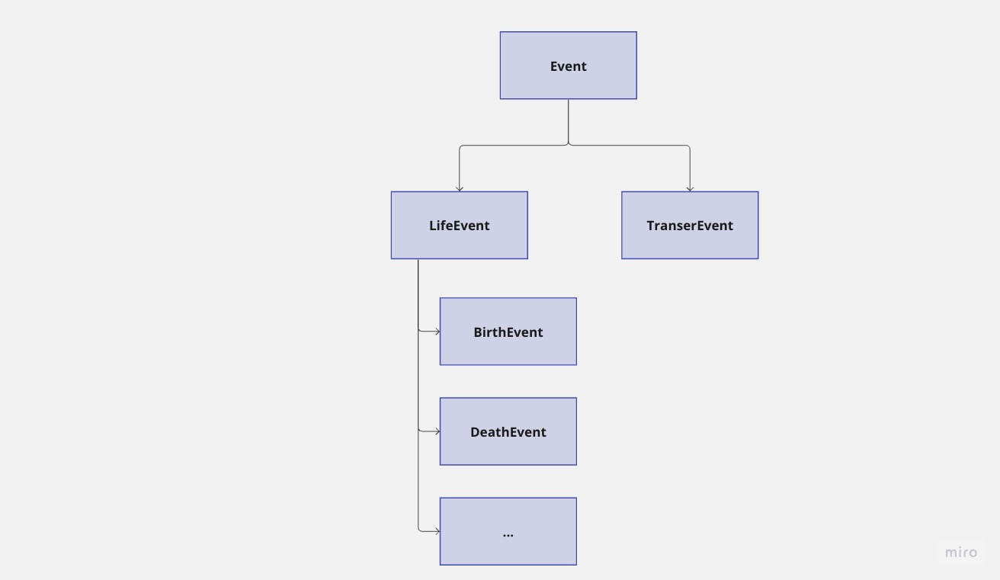
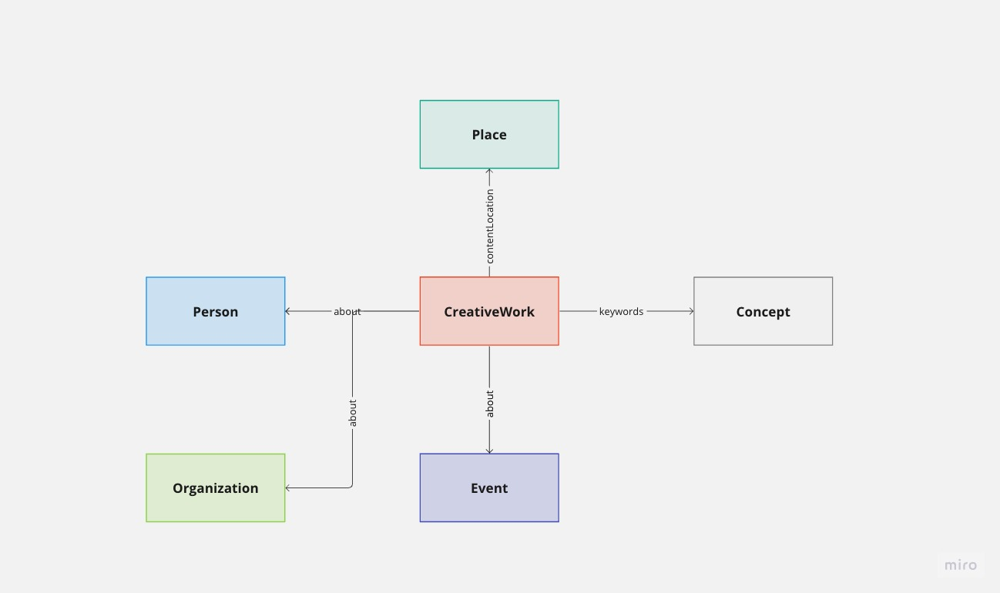
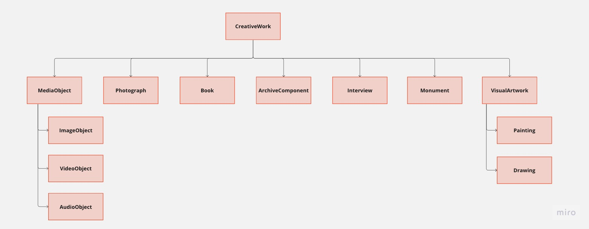
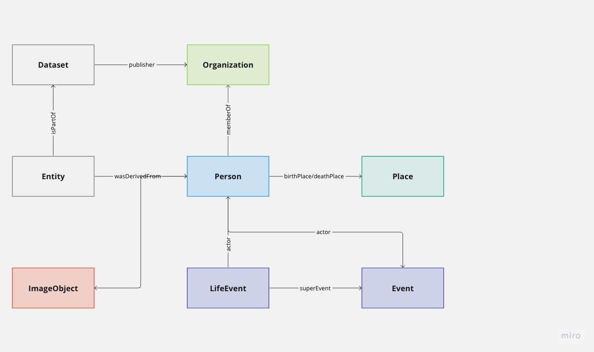

# Data model voor project indisch erfgoed digitaal

Voor het project indisch erfgoed digitaal gebruiken we een [applicatie profiel](./jsonldcontext.jsonld) dat een aantal bestaande schema's hergebuikt, zoals [schema.org](http://schema.org), [prov-o](https://www.w3.org/TR/prov-o/) en [SKOS](https://www.w3.org/TR/2009/REC-skos-reference-20090818/). Extra types en relaties die nodig zijn voor het indisch ergoed hebben we gedefinieerd als [extensie van schema.org](./schema_ext-indischerfgoed.ttl). 

Hieronder beschrijven we het model in hoofdlijnen. 

Raadpleeg de [volledige documentatie](https://indischerfgoed.github.io/schema/) voor een overzicht van alle types en alle properties per type.

## Event
Centraal in het model staat het Event (paars). 

Het type event specifieren we in een aantal subtypes.

## CreativeWork
De collectie objecten beschouwen we als werken (CreativeWork). 

Het type werk specificeren we in een aantal subtypes.

## Person

